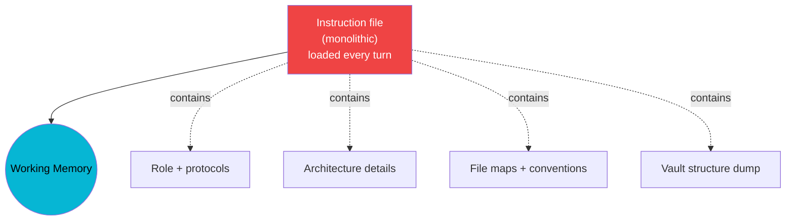
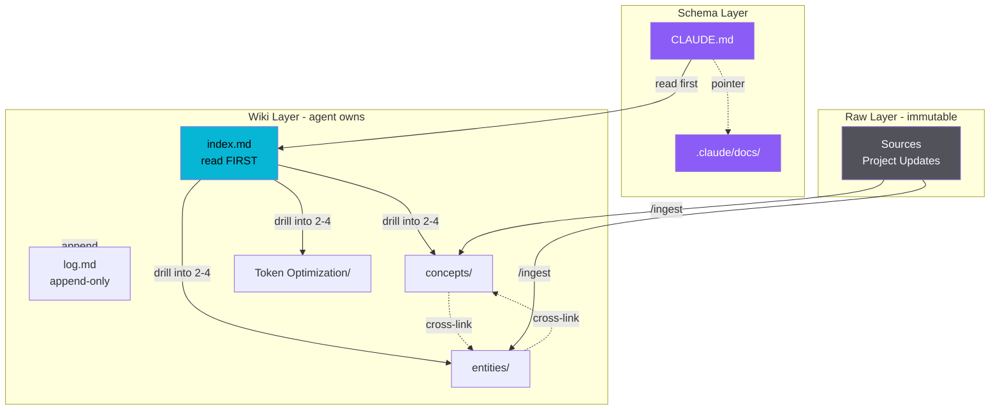

# Token Optimization Dashboard

> [!info] Two views available
> **This file** = vault-native (Mermaid renders inline in editors that support it).
> **`dashboard.html`** = standalone interactive HTML with charts and persistent checklist. Open in browser via `{{COMMAND_PREFIX}} dashboard`.

## At-a-Glance

| Metric | Value |
|--------|-------|
| **Per-session savings (current)** | *— update after first measurement* |
| **Projected target** | -85% (post full adoption) |
| **Instruction file size** | *— bytes* |
| **Wiki state** | *— concepts, — entities, — log entries* |

## Architecture — Before vs After

### Before (monolithic instruction file)

### After (pointer + three-layer wiki)

## Methodology Adoption Status

| # | Principle | Status |
|---|---|---|
| 1 | Instruction file as schema (pointer skeleton) | 🟢 DONE |
| 2 | Index-first protocol | 🟢 DONE |
| 3 | Three-layer separation (raw / wiki / schema) | 🟡 ACTIVE |
| 4 | `index.md` with summaries + categories | 🟢 DONE |
| 5 | `log.md` append-only audit | 🟢 DONE |
| 6 | Agent owns wiki layer | 🟡 ACTIVE |
| 7 | Ingest workflow (touches 5-15 pages) | 🟢 DONE |
| 8 | Periodic lint pass | 🟡 ACTIVE |
| 9 | Machine-readable schemas (tables, frontmatter) | 🟢 DONE |
| 10 | `.claudeignore` for indexing layer | 🟢 DONE |
| 11 | Token-savings feedback loop | 🟢 DONE |
| 12 | Trigger-condition pointer table | 🟢 DONE |

**Legend:** 🟢 DONE · 🟡 ACTIVE · 🔴 TODO

## Token Math — Projected Stages

Numbers are projections — replace with measured values once a baseline has been captured.

## Implementation Checklist

### ✓ Installed
- [x] Suite installed in project root
- [x] CLAUDE.md refactored to pointer skeleton
- [x] `.claudeignore` configured
- [x] `.claude/docs/` contains dereferenced sections
- [x] `/ingest` skill registered
- [x] `/lint-wiki` skill registered
- [x] `/token-checkup` skill registered
- [x] `index.md` created
- [x] `log.md` created
- [x] `dashboard.html` serving locally

### ◐ In Progress
- [ ] Seed first 5 concept pages via `/ingest`
- [ ] Seed first 5 entity pages via `/ingest`
- [ ] Capture baseline token measurement
- [ ] Add Session Start Protocol to instruction file

### ○ TODO
- [ ] Add `Project_Status.md` to vault `Memory/` folder
- [ ] Add `Technical_Debt.md` to vault `Memory/` folder
- [ ] First `/lint-wiki` pass
- [ ] First `/token-checkup` run
- [ ] Document custom triggers in instruction file if needed
- [ ] Verify dashboard renders all sections

## Related

- [[Token Optimization Index]] — running savings log
- [[concepts/]] — architectural patterns
- [[entities/]] — components, services, tools
- `dashboard.html` — interactive HTML version (open in browser)
